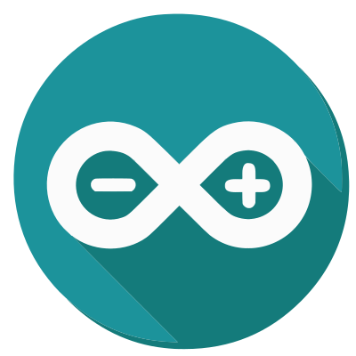

  

  <h1>Arduino</h1>
  <h4>An Open-Source Electronics Platform</h4>

### Overview
Arduino is an open-source electronics platform that combines easy-to-use hardware and software. With its wide variety of microcontroller boards, it's perfect for prototyping and building interactive projects.

### Examples!
* [Night Light](./arduino/examples/night-light.md)

### Arduino Board Types
* Arduino "Classic"
* Arduino Nano
* Arduino MKR
* Arduino Mega/Giga
* [Legacy/Retired Arduino](https://docs.arduino.cc/retired/)

### Basic Arduino Specifications
- **Microcontroller:** ATmega328P, SAMD21, ESP32, etc., depending on the board.
- **Operating Voltage:** Typically 5V or 3.3V.
- **Digital I/O Pins:** Varies (e.g., 14 on the Uno).
- **PWM Pins:** Varies (e.g., 6 on the Uno).
- **Analog Input Pins:** Varies (e.g., 6 on the Uno).
- **Communication Interfaces:** UART, SPI, I2C.
- **Programming Language:** C++ (Arduino Framework).
- **Software Environment:** Arduino IDE.

### Learning Resources
* **Official Arduino Documentation:** [Getting Started Guide](https://www.arduino.cc/en/Guide/HomePage)
* **Tutorials and Examples:** [Arduino Project Hub](https://create.arduino.cc/projecthub)
* **To Get Started:** [Arduino Get Started](https://arduinogetstarted.com/)
* **Books:**
  * [Getting Started with Arduino](https://www.amazon.com/Getting-Started-Arduino-Electronics-Prototyping/dp/1680456938?dib=eyJ2IjoiMSJ9.xhme4oXrGHXZkKuAjAlfqFiBHXeRHMIAsgFdrdVQ0hXjcDke0tZ2MHmMTRy3rBAcLCLLfaIZ3ODED16L9bBzNcE-Pj2E5jKJRoZAb44GiXbYlcND_lbWvannimaWy4pF64ACRFMyPAyJZT-liaw0sN4FTt7gX490kUAsw418AeImyAnW0xo44DbPnsgbdzpotvSpqjxR9yhFgR-_pbBd0jXw2Hsxk6YACpVjJTyky60.1USmW7VYfetmFFjTjqPRPFWwPhqGr-oSO3LA16N6wCg&dib_tag=se&keywords=Getting+Started+with+Arduino&qid=1732601347&s=books&sr=1-1) by Massimo Banzi.
  * [Arduino Cookbook](https://www.amazon.com/Arduino-Cookbook-Recipes-Enhance-Projects/dp/149190352X?crid=2SHM6FKGRGVR7&dib=eyJ2IjoiMSJ9.6aa3dizi-CoC4gqimWYMx8FgUqCfon9XLPTZ1qTPlRiX-lDKkY5z0IzuWLaOAU8fna9ownd57Nw0s1hIsmKU2p5NpUEYWTd_aYF7BFeeC3V6kEajiCxQX6CCflmJUV9v0MvsQHWU-rAD1gliJgAeDyrxrYuU-dBnsT1WTuepdFiGgu7iRnjBVbxd3dLHAoHwAjwyfWFsOwzcF3eYMyI3TDmx8VRNGzvKELZkSAiwJOc.Yx_wMYQCvEmNXfggyxPy-TWvsaBuowFtxvPxMWZ26BU&dib_tag=se&keywords=Arduino+Cookbook&qid=1732601438&s=books&sprefix=arduino+cookbook%2Cstripbooks%2C175&sr=1-1) by Michael Margolis.
  * [Practical Electronics for Inventors](https://www.amazon.com/Practical-Electronics-Inventors-Fourth-Scherz-dp-1259587541/dp/1259587541) by Paul Scherz and Simon Monk
* **Online Courses:**
  * [Coursera](https://www.coursera.org/)
  * [Udemy](https://www.udemy.com/)
* **Communities:**
  * [Arduino Forum](https://forum.arduino.cc/)
  * [Reddit - r/arduino](https://www.reddit.com/r/arduino/)
